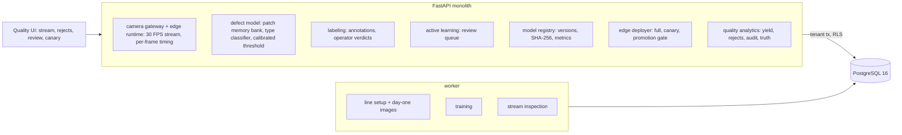

# Autonomous Industrial Computer-Vision Quality Inspection

For a factory's end-of-line camera. It learns what a good part looks like from the first shift's good parts and a handful of labelled
defects, inspects a 30 FPS stream on an edge simulator with every frame timed, lets an operator mark the rejects that were really good
parts, retrains, ships the new model as a canary beside the old one, and promotes it only through a gate on what the line can observe.
Every decision is set against the truth the camera never sees.

Built from blueprint 14 of "Advanced Engineering Build Book, Volume IV" as a **vertical slice**: the demo scenario end to end, with the
platform parts real and the rest listed under [Not built](#not-built-and-why).

**Every image is rendered by a generator in this repository: no real line, camera or part. Boards, pouches and brackets, their defects
and the lighting are synthetic, and so is the operator at the review station (it labels from the truth, with deliberate mistakes). The
models never see the truth; it is shown only to judge them. No language model is used.**

## Run it

```bash
docker compose up --build        # migrates, seeds, serves http://localhost:8360/ui/ with one worker
docker compose run --rm test     # 11 tests against a throwaway database (about 1.5 minutes)
```

Open http://localhost:8360/ui/ and press **Run all steps** (about a minute), or `make bootstrap demo`.
Demo tokens (local only): `plant-quality_manager-demo`, `plant-quality_engineer-demo`, `plant-operator-demo`, `plant-viewer-demo`.
Run `make reset` before a second demo run.

## The demo, step by step

1. An invented controller-board line, one top camera at 30 FPS, 64 × 64 grayscale frames. Day one: 200 good boards from the first shift,
   24 labelled defects (eight each of missing component, solder bridge, scratch) and 150 more good boards held back to set the
   threshold. Every frame has its own lamp gain and offset, a brightness gradient, sensor noise and the board up to 1.5 px off centre.
2. Version 1 is trained on good boards only for the anomaly part, with the threshold set so 1% of the held-back good boards would be
   rejected (1.3% are). It catches 17 of the 24 labelled defects; the golden-template baseline catches 8. Missing components and solder
   bridges 8 of 8 each, scratches 1 of 8, and the page says so before the line starts. The type classifier names 83% of the labelled
   defects right (cross-validated). The 7.5 MB artifact is stored with its SHA-256; the edge checks the hash before loading it.
3. 3,000 frames (100 s of line), 3% defective. At 50 s purchasing switches capacitor supplier: good parts, a lighter body, a pixel wider.
   Inspection p50 1.02 ms, p99 18.39 ms against a 33.3 ms budget; 9 frames over it (worst 98 ms). The reject rate goes from about 5% to
   about 75%: version 1 rejects 100% of new-supplier boards. The auditor checked 91 passed boards (5%) and found no escapes; in truth
   13 of 93 defective boards passed, 11 of them scratches. Rejects by named type: scratch 553, missing component 549, solder bridge 40;
   most are good new-supplier boards, because a classifier trained on three types calls every anomaly one of them.
4. The review queue clusters the 1,142 rejects by what is wrong with them and takes the most typical frames of each cluster, 40 in all.
   The stand-in operator marks 34 good parts and 6 real defects, and gets 3 of the 40 wrong (it is set to err 2% of the time).
5. Version 2 adds the operator's good boards to the memory bank, but only at the 45 of 225 patch positions where they looked wrong. It
   goes out as a canary on 20% of frames beside version 1 while the line runs another 3,000 frames with the new part on 70% of boards.
   The canary rejects 20.3% of its frames, the control 70.8%. The canary's false rejects on new-supplier boards: 24.0% (control 100%).
   But it passes 3 of 19 defects on new-supplier boards, which the control caught only by rejecting those boards outright.
6. The quality manager promotes the canary through a gate: lower reject rate, and an audit sample no worse than the control's (0 escapes
   in 32 canary boards, 0 in 42 control boards). The deployer of the canary cannot promote it. The gate passes, but the audit sample is
   far too small to see what the simulation truth shows: the canary's escapes are 5 of 29 (17.2%) against the control's 6 of 83 (7.2%).
   Hash-chained audit log.

## Architecture



| Piece | How it works |
|---|---|
| Generator (`qi/world.py`) | Three products drawn in numpy: a board (traces, four components with pads), a sealed pouch (crosshatched seal, printed label, film texture), a machined bracket (brushed streaks, three holes). Defects drawn with their true masks and a wide contrast range, so some are faint: missing component, solder bridge, scratch; seal gap, contamination, wrinkle; scratch, dent, missing hole. Per frame: lamp gain 0.88–1.12, offset ±0.05, a linear gradient, sensor noise, a sub-pixel shift. A second supplier's capacitor (lighter, 1 px wider) can be switched on from any frame. |
| Anomaly model (`qi/engine.py`) | PatchCore in miniature. Each image is standardised (removes lamp gain and offset); every 8 × 8 patch at stride 4 (225 positions) becomes 24 PCA coordinates plus its distance from the PCA subspace, which keeps a thin scratch PCA cannot express. Good boards' patches at their position and shifted ±2 px form a memory bank per position, thinned by greedy k-centre to 320. A frame scores each patch by its nearest normal neighbour; the frame's score is the worst patch. |
| Threshold and confidence | The threshold is the 99th percentile of held-back good parts (a 1% false-reject target). Confidence: logistic regression on log score from those good parts and the labelled defects, re-weighted from the labelled set's mix to the line's 3% defect rate. |
| Type, box | A random forest on where and how the worst patches are wrong (peak, spread, elongation, position, residual against the mean good image). The box covers the patches above the threshold and above 70% of the peak. |
| Baseline | Golden template: the mean standardised good image; the largest 3 × 3-smoothed difference with one pixel of shift tolerance; its own threshold on the same held-back parts. |
| Few-shot adaptation | Operator-confirmed good parts join the memory bank only at the positions where they scored above 0.8 × threshold, up to 128 extra vectors per position. Added everywhere, they made every nearest neighbour closer and hid faint defects all over the part. |
| Review queue | k-means (8 clusters) on the rejects' type features; the most typical frame of each cluster in turn, largest cluster first. |
| Edge runtime | The stream job renders each frame, quantises it to 8 bits, routes it to the canary with its share's probability, times `inspect`, keeps the PNG of every reject and of each part the auditor pulls (5% of passes), and a hash for the rest. |
| Platform | Row-level security per manufacturer, Postgres job queue, Idempotency-Key replay, hash-chained audit log, model artifacts with SHA-256 checked on load, four-eyes promotion, `/metrics`. |

## Data model

`migrations/002_qi.sql` follows the blueprint (factory, line, camera, product, inspection, image, defect, annotation, model_version,
deployment, operator_feedback); additions are marked `(+)`: `inspection_run` for each stretch of the stream, the image's PNG and its
simulation truth (used only to score), the inspection's arm, audit flag and anomaly map, and the annotation's split and source.

## API

| Method | Endpoint | Purpose |
|---|---|---|
| POST | `/v1/lines:load` | (+) 202 + job: factory, product, line, camera and the day-one training set |
| POST | `/v1/models/train` | 202 + job: a model version from the annotations (and operator feedback), with its metrics and hash |
| POST | `/v1/deployments` | Deploy a version to the edge, full or as a canary on at most half the frames |
| POST | `/v1/inspections` | 202 + job: a stretch of the 30 FPS stream through the deployed models |
| GET | `/v1/defects?run_id=` | Rejects with image, anomaly map, box, type, confidence; the Pareto of types |
| GET | `/v1/review-queue?run_id=` | (+) Active learning: which rejects an operator should look at |
| POST | `/v1/annotations` | An operator's verdicts on rejects: false positive or confirmed defect |
| POST | `/v1/review-queue:simulate-operator` | (+) The stand-in operator, labelling from the truth with an error rate |
| POST | `/v1/deployments/{id}/promote` | (+) Canary to full behind the observable gate; four eyes |
| GET | `/v1/lines/{id}/quality` | Yield, rejects, audit findings, latency by stretch and model, the truth alongside |

Contract: [`docs/openapi.json`](docs/openapi.json).

## Measured

[`docs/evaluation.md`](docs/evaluation.md) (`python -m qi.evaluate`: nine lines the demo never uses, three per product, each scored on
3,000 fresh frames with 10% defects) and [`docs/performance.md`](docs/performance.md).

| | Patch memory bank | Golden template |
|---|---|---|
| AUROC | 0.877–0.941 | 0.772–0.823 |
| False rejects (target 1%) | 0.3–2.8% | 0.3–2.5% |
| Escapes, boards | 19–21% | 57–66% |
| Escapes, pouches | 32–52% | 51–60% |
| Escapes, brackets | 36–42% | 64–65% |
| Missing component, seal gap, missing hole escaped | 0 of 867 | |
| Scratches escaped (boards, brackets) | 51–74% | |
| Wrinkles escaped | 82–100% | |
| Defect type right, of those caught | 84–98% | |
| Box touching the true defect, of those caught | 98–100% | |
| Inspection time per frame, one core | p50 0.69 ms, p99 7.77 ms (Docker demo: p99 17–18 ms) | |

The model is a large improvement on the template and still lets a fifth to half of all defects through at a 1% false-reject target.
What it misses is consistent: anything that changes a whole patch (a missing part, a gap in a seal, a missing hole, a solder bridge) is
caught almost every time; anything a pixel wide or a few percent of brightness (a scratch, a wrinkle, a shallow dent) mostly is not, at
this resolution and this noise.

**The supplier change, three board lines, 40 reviewed rejects:** version 1 rejects 100% of good new-supplier boards. Retrained on the
reviewed good boards, 20–27% (rejects chosen by cluster), 19–28% (chosen at random), 52–69% (nearest the threshold), 89–96% (highest
score, because those are mostly real defects). False rejects on old-supplier boards stay between 0.8% and 2.4%. The cost: defects on
new-supplier boards that version 1 rejected along with the board now pass, 9–18 of 116–119 (by cluster) and 14–19 (at random). Choosing the review by cluster **did not beat choosing
at random**; it is in the product because it guarantees a small cluster is looked at, which random review does not.

## The hardest tradeoff

What the operator's "this is a good part" is allowed to teach. A false reject is visible and costs money every minute, so the pressure is
all one way: feed the corrections back and the reject rate falls. But every good part added to the memory bank makes some anomalies look
normal. Added everywhere, 34 new-supplier boards hid faint scratches across the whole board; added only where they looked wrong (45 of
225 positions), they still hide defects at exactly those positions, and 3 of 19 defects on new-supplier boards passed in the demo that
version 1 had caught. The line cannot see this: escapes show up only in the 5% audit, a few dozen boards per 100 seconds of line, in which a
passed defect turns up less than once. So the gate here is honest about being weak, the page puts the truth beside it, and the threshold stays set on held-back
good parts rather than drifting with the corrections. A real line would need a much larger audit after any retrain, or seeded test parts
with known defects run through the camera.

## Threat model (summary)

| Threat | Mitigation here | Gap |
|---|---|---|
| A model swapped on the edge | Artifact SHA-256 stored at training, checked before deploy and before loading; a tampered hash is refused (tested) | Hash in the same database as the artifact; no signing key |
| One person shipping their own model | The deployer of a canary cannot promote it; promotion needs a quality manager and passes a gate | The gate's audit sample is too small to catch an escape-rate change at demo length |
| Bad labels poisoning the next model | Only rejects can be reviewed, once each; every verdict carries the operator and is audited | Operator mistakes go into training unreviewed (3 of 40 in the demo) |
| A canary taking over the line | At most half the frames; needs a full deployment as control | |
| One manufacturer seeing another's images | Row-level security on every table; tested through the API and directly in the database | |

## Not built, and why

- **Real images, real cameras, real defects**: generated instead, so every decision can be scored against the truth.
- **High-resolution frames, colour, multiple cameras or views**: 64 × 64 grayscale keeps evaluation to minutes on a laptop; the patch memory bank scales with pixels (see performance).
- **Object detection and segmentation networks, pretrained CNN features, a GPU**: no deep-learning framework in this environment; PCA patch features stand in for a backbone and are the reason fine scratches are missed.
- **Synthetic defect generation for training**: the generator makes defects for evaluation only; the models train on the 24 labelled ones.
- **Defect-specific thresholds and a cost model for escapes against false rejects**: one threshold per model, set for 1% false rejects.
- **Kafka, Triton, Kubernetes, a real edge device, MLflow, Terraform, CI, SSO, a Next.js front end**: not needed to prove the slice; no cloud account used.

## Commercial sketch

Buyer: manufacturers in electronics, packaging and metal parts. Pricing shape from the blueprint: per camera or line, plus model
training and edge licences, with an enterprise tier for on-premises deployment, audit export and SSO.

## Layout

```
core/        platform kit: db + RLS, jobs, audit chain, HTTP, scenario runner, load test
qi/          world (products, defects, lighting, stream), engine (patch memory bank, threshold, classifier, review queue), api, seed, evaluate
migrations/  forward-only SQL          web/   UI, scenario.json, demo.json (recorded run)
tests/       11 tests                  docs/  evaluation.md, performance.md, openapi.json
```
